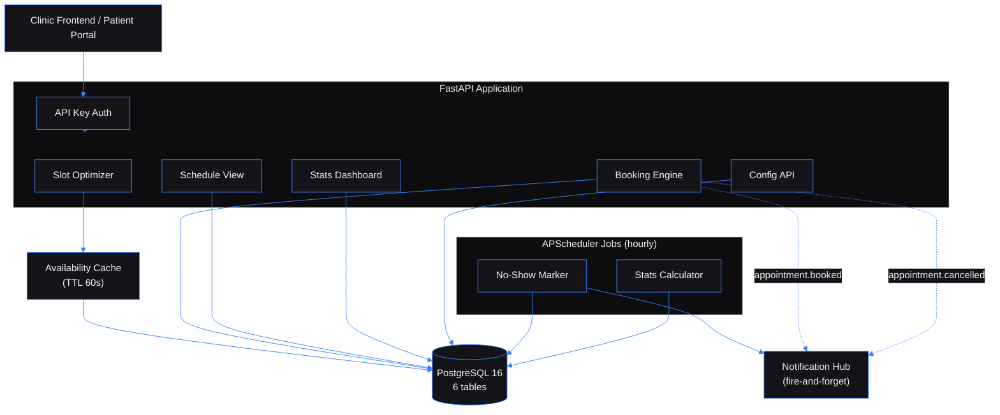

# Healthcare Appointment Slot Optimizer — Constraint-based scheduling engine for healthcare clinics

Built by [Kingsley Onoh](https://kingsleyonoh.com) · Systems Architect

## The Problem

A mid-sized clinic with 5 providers and 8 rooms loses 15-20% of its daily capacity to scheduling gaps, no-shows, and room conflicts. The math is simple — each empty 30-minute slot is lost revenue that can't be recovered. This engine computes optimal appointment slots in real-time from provider availability, room requirements, equipment constraints, buffer times, and existing bookings. It prevents double-bookings at the database level and automatically identifies backfill candidates when cancellations create openings.

## Architecture



## Key Decisions

- **I chose real-time slot computation over pre-generated slot tables** because stored slots require constant sync with every booking, cancellation, and availability change. Computing on-the-fly from constraints means the answer is always correct — no stale data, no sync jobs.
- **I chose database UNIQUE constraints over application-level locking for double-booking prevention** because race conditions in application code are subtle and hard to test. Two `INSERT` statements hitting the same `(provider_id, date, start_time)` — one wins, one fails. Proven at the Postgres level under 10 concurrent requests.
- **I chose fire-and-forget event emission over synchronous webhooks** because a booking should never fail because the notification service is down. The hub client swallows all errors — booking operations complete regardless of external service state.
- **I chose in-memory TTL cache over Redis for availability windows** because this is a single-process deployment. Adding Redis for one cache key adds operational complexity with no benefit. The 60-second TTL invalidates on its own, and explicit invalidation covers availability updates.
- **I chose APScheduler in-process over Celery for background jobs** because the no-show marker and stats calculator are lightweight queries on a schedule. Celery requires a broker (Redis/RabbitMQ), a worker process, and monitoring. APScheduler runs inside the FastAPI process with zero infrastructure overhead.

## Setup

### Prerequisites

- Python 3.12+
- PostgreSQL 16 (via Docker)
- Docker + Docker Compose

### Installation

```bash
git clone https://github.com/kingsleyonoh/Healthcare-Appointment-Slot-Optimizer.git
cd Healthcare-Appointment-Slot-Optimizer
python -m venv venv
source venv/bin/activate  # or .\venv\Scripts\Activate.ps1 on Windows
pip install -e ".[dev]"
```

### Environment

```bash
cp .env.example .env
```

| Variable | Required | Description |
|----------|----------|-------------|
| `DATABASE_URL` | Yes | PostgreSQL connection string (`postgresql+asyncpg://...`) |
| `API_KEYS` | Yes | Comma-separated valid API keys for auth |
| `ENV` | No | `development` (default) or `production` |
| `HOST` | No | Server bind address (default: `0.0.0.0`) |
| `PORT` | No | Server port (default: `8000`) |
| `SLOT_INCREMENT_MINUTES` | No | Slot generation interval (default: `15`) |
| `DEFAULT_BUFFER_MINUTES` | No | Buffer between appointments (default: `10`) |
| `MAX_DAILY_APPOINTMENTS` | No | Per-provider daily cap (default: `20`) |
| `OVERBOOK_DEFAULT` | No | Default overbooking limit (default: `0`) |
| `NOTIFICATION_HUB_URL` | No | Notification Hub base URL (empty = disabled) |
| `NOTIFICATION_HUB_API_KEY` | No | Hub API key |
| `NOTIFICATION_HUB_ENABLED` | No | Enable event emission (default: `false`) |
| `LOG_LEVEL` | No | Logging verbosity (default: `info`) |

### Run

```bash
docker compose up -d          # Start PostgreSQL
alembic upgrade head          # Run migrations
python -m src.db.seed         # Seed sample data (5 providers, 8 rooms, 6 types, 219 bookings)
uvicorn src.main:app --reload # Start dev server
```

## Usage

All endpoints except `/api/health` require an `X-API-Key` header.

### Find Available Slots

Query the optimizer for a specific date and appointment type. Returns scored, sorted slots across all providers with room assignments.

```bash
curl http://localhost:8000/api/slots \
  -H "X-API-Key: dev-key-1" \
  -G -d "target_date=2026-04-13" \
     -d "appointment_type_id=<uuid>"
```

```json
{
  "slots": [
    {
      "start": "09:15:00",
      "end": "09:45:00",
      "provider_id": "...",
      "provider_name": "Dr. Sarah Chen",
      "room_id": "...",
      "room_name": "Consultation A",
      "quality_score": 0.80,
      "is_overbooked": false
    }
  ],
  "next_available_date": null
}
```

### Book an Appointment

Pass a client-generated `request_id` for idempotency. Duplicate requests return the existing booking without creating a second one.

```bash
curl -X POST http://localhost:8000/api/bookings \
  -H "X-API-Key: dev-key-1" \
  -H "Content-Type: application/json" \
  -d '{
    "request_id": "clinic-app-001",
    "patient_name": "Jane Doe",
    "patient_email": "jane@example.com",
    "provider_id": "<provider-uuid>",
    "room_id": "<room-uuid>",
    "appointment_type_id": "<type-uuid>",
    "date": "2026-04-13",
    "start_time": "09:15:00"
  }'
```

```json
{
  "id": "997fa662-...",
  "request_id": "clinic-app-001",
  "patient_name": "Jane Doe",
  "status": "confirmed",
  "start_time": "09:15:00",
  "end_time": "09:45:00"
}
```

Attempting to book the same provider+room+time returns `409 SLOT_UNAVAILABLE`. Concurrent requests are safe — the database constraint decides the winner.

### Cancel and Get Backfill Candidates

Cancellation returns the updated booking and a list of patients who could fill the freed slot, ranked by time proximity.

```bash
curl -X PUT http://localhost:8000/api/bookings/<booking-id>/cancel \
  -H "X-API-Key: dev-key-1" \
  -H "Content-Type: application/json" \
  -d '{"reason": "Patient rescheduled"}'
```

```json
{
  "booking": { "id": "...", "status": "cancelled", "cancellation_reason": "Patient rescheduled" },
  "backfill_candidates": [
    { "candidate_booking_id": "...", "patient_name": "Bob Martinez", "appointment_type": "General Checkup", "time_proximity_score": 0.86 }
  ]
}
```

### View Provider Schedule

Returns a daily breakdown of bookings, gaps, and utilization for a date range.

```bash
curl "http://localhost:8000/api/schedule?date_from=2026-04-10&date_to=2026-04-10" \
  -H "X-API-Key: dev-key-1"
```

```json
{
  "schedule": [
    {
      "date": "2026-04-10",
      "provider_name": "Dr. Sarah Chen",
      "bookings": [{"start_time": "08:15:00", "end_time": "08:30:00", "patient_name": "Jack Thompson", "status": "confirmed"}],
      "gaps": [{"start_time": "08:30:00", "end_time": "09:45:00", "duration_minutes": 75}],
      "utilization": 0.111
    }
  ],
  "summary": { "total_utilization": 0.111 }
}
```

### Check Dashboard Stats

```bash
curl http://localhost:8000/api/stats -H "X-API-Key: dev-key-1"
```

```json
{
  "utilization_today": 0.0889,
  "bookings_today": 16,
  "no_shows": 1
}
```

## Tests

```bash
python -m pytest                                    # 229 tests
python -m pytest --cov=src --cov-report=term-missing # With coverage (84.5%)
```

The test suite includes unit tests for the optimizer engine, scorer, booking service, and cache; integration tests for every API endpoint; a performance benchmark (slot computation under 500ms for 5 providers); and a concurrent booking stress test (10 parallel requests for the same slot — exactly 1 wins).

## Deployment

This project runs on a DigitalOcean VPS behind Traefik with automatic SSL and image pulls via Watchtower.

### Production Stack

| Component | Role |
|-----------|------|
| `healthcare-slot-optimizer` | FastAPI application container |
| `scheduler-postgres-prod` | PostgreSQL 16 database |
| Traefik | Reverse proxy + Let's Encrypt SSL |
| Watchtower | Auto-pulls new GHCR images every 5 min |

### Self-Host

```bash
# Clone and configure
git clone https://github.com/kingsleyonoh/Healthcare-Appointment-Slot-Optimizer.git
cd Healthcare-Appointment-Slot-Optimizer
cp .env.example .env
# Edit .env with production values

# Deploy
docker compose -f docker-compose.prod.yml up -d
```

The entrypoint runs `alembic upgrade head` automatically before starting the server. Set the environment variables listed in **Setup > Environment** before starting.

---

Full case study, architectural breakdown, and engineering deep-dive at [kingsleyonoh.com/projects/clinical-scheduling-engine](https://www.kingsleyonoh.com/projects/clinical-scheduling-engine)
